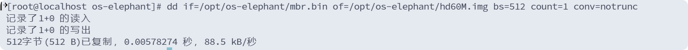

# -os-elephant
操作系统真象还原

# bochs 安装

版本：2.6.2
./configure  --enable-ne2000  --enable-all-optimizations --enable-cpu-level=6  --enable-x86-64 \
          --enable-vmx=2 \
          --enable-pci \
          --enable-usb \
          --enable-usb-ohci \
          --enable-e1000 \
          --enable-debugger \
          --enable-debugger-gui \
          --enable-disasm \
          --with-sdl \
          --with-x11

vim Makefile
:92
-lpthread

make -j 4
make install

**需要在窗口进行相关操作**

细看 https://www.cnblogs.com/hell0er/p/17141942.html

[//]: # (./configure --enable-ne2000  --enable-all-optimizations  --enable-cpu-level=6 --enable-x86-64 --enable-vmx=2 --enable-pci --enable-usb --enable-usb-ohci --enable-e1000 --enable-debugger --enable-debugger-gui --enable-disasm --with-sdl --with-x11)

# 追加asm到img

//汇编 编译
nasm -o mbr.bin mbr.S

dd if=/opt/os-elephant/mbr.bin of=/opt/os-elephant/hd60M.img bs=512 count=1 conv=notrunc

